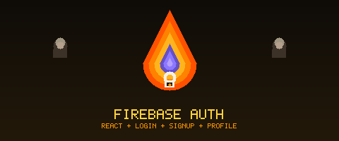

<div align="center">
  

  [](https://reactjs.org/)
  [](https://firebase.google.com/)
  [](https://react-bootstrap.github.io/)

  **🔥 Full authentication flow with Firebase — signup, login, password reset, and profile updates 🔐**

</div>

---

## ✨ Features

- 📝 **Sign up** — create a new account with email and password
- 🔑 **Login / Logout** — persistent session via Firebase
- 🔁 **Forgot password** — sends a reset link by email
- ✏️ **Update profile** — change email or password from the dashboard
- 🚪 **Protected routes** — `PrivateRoute` component redirects unauthenticated users
- 🧠 **Auth context** — global auth state via React Context API

## 🚀 Quick Start

### 1. Create a Firebase project

Go to [console.firebase.google.com](https://console.firebase.google.com/), create a project, and enable **Email/Password** authentication.

### 2. Configure environment

Create `.env` in the project root:

```env
REACT_APP_API_KEY=your-api-key
REACT_APP_AUTH_DOMAIN=your-project.firebaseapp.com
REACT_APP_PROJECT_ID=your-project-id
REACT_APP_STORAGE_BUCKET=your-project.appspot.com
REACT_APP_MESSAGING_SENDER_ID=your-sender-id
REACT_APP_APP_ID=your-app-id
```

### 3. Run

```bash
npm install
npm start
```

Open `http://localhost:3000`.

## 🏗️ App Structure

```
src/
├── components/
│   ├── Login.js          # Login form
│   ├── Signup.js         # Registration form
│   ├── Dashboard.js      # Protected home page
│   ├── ForgotPassword.js # Password reset form
│   ├── UpdateProfile.js  # Profile update form
│   └── PrivateRoute.js   # HOC for protected routes
├── contexts/
│   └── AuthContext.js    # Auth state provider
└── firebase.js           # Firebase config and init
```

## 🛠️ Tech Stack

- **React 17**
- **Firebase v8** — Authentication
- **React Bootstrap** — UI components
- **React Router v5** — navigation and route protection
- **React Context API** — global auth state
